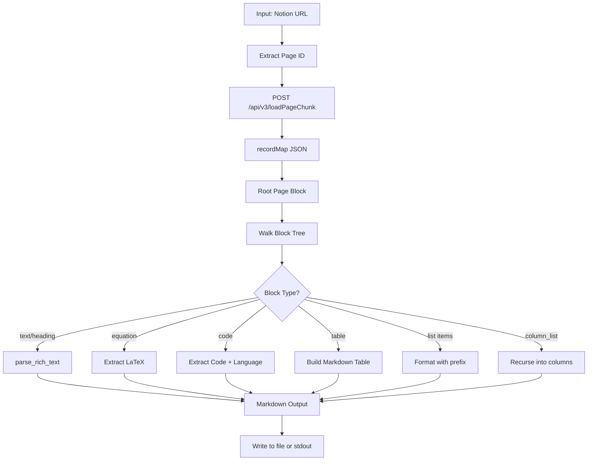

# Notion Public Page Parser — Architecture Document

**Target URL:** `https://technostrife.notion.site/70e536c9c1dc4cd3a0f23d21d9e1a645`

---

## 1. Approach

### Decision: Hybrid — Unofficial JSON API + Selective HTML Fallback

Notion public pages are **React Single-Page Applications** (SPAs). The visible HTML is rendered client-side from a JSON payload. This means:

- Raw `requests.get(url)` returns a nearly empty HTML shell with a `<script>` tag bootstrapping React.
- **Selenium/Playwright** can render the full DOM, but is heavy and slow.
- The **best approach** is to call Notion's **unofficial internal JSON API** directly, which the browser itself uses to hydrate the page.

### Why Not the Official Notion API?

The official Notion API (`api.notion.com`) requires an integration token and the page must be shared with that integration. Public pages shared via `notion.site` do **not** require a token — they are accessible via the unofficial `loadPageChunk` endpoint.

### Unofficial API Endpoint

```
POST https://www.notion.so/api/v3/loadPageChunk
```

**Request body:**
```json
{
  "pageId": "70e536c9-c1dc-4cd3-a0f2-3d21d9e1a645",
  "limit": 100,
  "cursor": {"stack": []},
  "chunkNumber": 0,
  "verticalColumns": false
}
```

This returns a `recordMap` containing all blocks, their types, and their content as structured JSON — **no browser rendering required**.

### Page ID Extraction

The page ID is embedded in the URL path:
```
https://technostrife.notion.site/70e536c9c1dc4cd3a0f23d21d9e1a645
                                  ^^^^^^^^^^^^^^^^^^^^^^^^^^^^^^^^
                                  32-char hex → UUID with dashes
```

Conversion: `70e536c9c1dc4cd3a0f23d21d9e1a645` → `70e536c9-c1dc-4cd3-a0f2-3d21d9e1a645`

---

## 2. Libraries Needed

| Library | Version | Purpose |
|---------|---------|---------|
| `requests` | ≥2.28 | HTTP calls to Notion's unofficial API |
| `python-dotenv` | optional | Environment config (if needed) |

**Standard library only (no extra deps needed):**
- `json` — parse API responses
- `re` — regex for URL/ID extraction and text cleanup
- `uuid` — format page ID with dashes
- `sys`, `argparse` — CLI interface
- `textwrap` — output formatting

**No Selenium, Playwright, or BeautifulSoup required** — the JSON API returns structured data directly.

**Optional (for richer output):**
| Library | Purpose |
|---------|---------|
| `rich` | Pretty terminal output with syntax highlighting |

---

## 3. Block Type Mapping

Notion's `recordMap.block` is a dictionary of block objects. Each block has a `type` field and a `properties` dict containing `title` (rich text array) and other type-specific fields.

### Rich Text Format

Notion stores text as an array of segments: `[["text content", [["annotation_type", "value"], ...]]]`

Example: `[["Hello ", [["b"]]], ["world", [["i"], ["c"]]]]` → `**Hello** *world*`

### Block Type → Output Mapping

| Notion Block Type | Output Format | Notes |
|-------------------|---------------|-------|
| `page` | `# Page Title\n` | Root block, title from `properties.title` |
| `text` | Plain paragraph | May contain inline annotations |
| `header` | `# Heading 1` | H1 |
| `sub_header` | `## Heading 2` | H2 |
| `sub_sub_header` | `### Heading 3` | H3 |
| `bulleted_list` | `- item` | Bullet point |
| `numbered_list` | `1. item` | Numbered list (counter tracked per parent) |
| `to_do` | `- [ ] item` or `- [x] item` | Checkbox from `properties.checked` |
| `toggle` | `> toggle title` + indented children | Collapsible block |
| `quote` | `> quoted text` | Blockquote |
| `callout` | `> [emoji] text` | Callout with icon |
| `code` | ` ```language\ncode\n``` ` | Language from `properties.language` |
| `equation` | `$$latex_expression$$` | Block-level math, LaTeX from `properties.title` |
| `table` | Markdown table | See Table Handling section |
| `table_row` | Table row data | Child of `table` block |
| `column_list` | Rendered as sequential sections | Layout block |
| `column` | Rendered as sequential section | Layout block |
| `divider` | `---` | Horizontal rule |
| `image` | `` | Image URL from `properties.source` |
| `video` | `[Video: url]` | Video embed |
| `file` | `[File: filename](url)` | Attached file |
| `pdf` | `[PDF: url]` | PDF embed |
| `bookmark` | `[Bookmark: title](url)` | Web bookmark |
| `link_to_page` | `[Link to page: id]` | Internal page link |
| `synced_block` | Render children | Synced content block |
| `template` | Render children | Template block |
| `child_page` | `## Subpage: title` | Nested page reference |
| `child_database` | `[Database: title]` | Inline database |
| `embed` | `[Embed: url]` | Generic embed |
| `breadcrumb` | *(skip)* | Navigation element |
| `table_of_contents` | *(skip or generate)* | TOC block |
| `unsupported` | `[Unsupported block]` | Fallback |

### Inline Annotation Mapping

| Annotation Code | Markdown Output |
|-----------------|-----------------|
| `b` | `**text**` |
| `i` | `*text*` |
| `s` | `~~text~~` |
| `c` | `` `text` `` (inline code) |
| `e` | `$latex$` (inline equation) |
| `a` | `[text](url)` |
| `h` | `==text==` (highlight, or plain) |
| `u` | `__text__` (underline) |

---

## 4. Formula Handling

### How Notion Stores Equations

**Block-level equations** (`type: "equation"`):
```json
{
  "type": "equation",
  "properties": {
    "title": [["E = mc^2"]]
  }
}
```
The LaTeX source is stored **verbatim** in `properties.title[0][0]`. No rendering or decoding needed.

**Inline equations** appear as rich text annotations with code `"e"`:
```json
["x^2 + y^2 = r^2", [["e"]]]
```
The LaTeX is the text content of the segment with the `"e"` annotation.

### Extraction Strategy

```
Block equation:
  properties.title[0][0]  →  wrap in $$...$$

Inline equation:
  segment[0] where segment[1] contains ["e"]  →  wrap in $...$
```

**No KaTeX/MathJax parsing required** — Notion stores the raw LaTeX source, not the rendered output. The parser simply extracts the string as-is.

### Output Examples

| Input (Notion JSON) | Output (Markdown) |
|---------------------|-------------------|
| Block eq: `"\\frac{a}{b}"` | `$$\frac{a}{b}$$` |
| Inline eq: `"x_i"` | `$x_i$` |
| Complex: `"\\sum_{i=0}^{n} x_i"` | `$$\sum_{i=0}^{n} x_i$$` |

---

## 5. Script Structure

### Module Layout

```
parse_notion/
├── ARCHITECTURE.md
└── parser.py          # Single standalone script
```

### Class and Function Design

```
parser.py
│
├── class NotionPageParser
│   ├── __init__(url: str)
│   │     Extract page_id from URL
│   │
│   ├── _extract_page_id(url: str) -> str
│   │     Regex: extract 32-char hex, insert dashes → UUID
│   │
│   ├── fetch_page_data() -> dict
│   │     POST to loadPageChunk API
│   │     Returns full recordMap
│   │
│   ├── _get_block_children(block_id: str) -> list[str]
│   │     Return ordered list of child block IDs
│   │     from recordMap["block"][block_id]["value"]["content"]
│   │
│   ├── _parse_rich_text(title_array: list) -> str
│   │     Iterate segments, apply annotations → Markdown
│   │     Handle inline equations (annotation "e")
│   │
│   ├── _parse_block(block_id: str, depth: int) -> str
│   │     Dispatch on block["value"]["type"]
│   │     Recursively process children
│   │     Return formatted string
│   │
│   ├── _parse_table(block_id: str) -> str
│   │     Collect table_row children
│   │     Build Markdown table with header separator
│   │
│   ├── _parse_code_block(block: dict) -> str
│   │     Extract language + content
│   │     Return fenced code block
│   │
│   ├── _parse_equation_block(block: dict) -> str
│   │     Extract LaTeX from properties.title
│   │     Return $$...$$ wrapped string
│   │
│   ├── parse() -> str
│   │     Entry point: fetch data, find root page block
│   │     Walk block tree via _parse_block
│   │     Return complete Markdown string
│   │
│   └── save(output_path: str)
│         Write parse() result to file
│
└── main()
      argparse: --url, --output, --format
      Instantiate NotionPageParser, call parse(), print/save
```

### Data Flow



### Pagination Handling

For large pages, Notion may paginate the `loadPageChunk` response. The parser must handle this:

```python
def fetch_page_data(self) -> dict:
    all_blocks = {}
    cursor = {"stack": []}
    while True:
        response = self._post_chunk(cursor)
        all_blocks.update(response["recordMap"]["block"])
        if not response.get("cursor", {}).get("stack"):
            break
        cursor = response["cursor"]
    return all_blocks
```

---

## 6. Output Format

### Primary Format: Markdown

The parser outputs **GitHub-Flavored Markdown (GFM)** with LaTeX math extensions.

### Sample Output Structure

```markdown
# Page Title

## Section Heading

Regular paragraph text with **bold**, *italic*, and `inline code`.

Inline math: $E = mc^2$ within a sentence.

$$
\int_0^\infty e^{-x^2} dx = \frac{\sqrt{\pi}}{2}
$$

### Code Example

```python
def hello():
    print("Hello, World!")
```

### Table Example

| Column A | Column B | Column C |
|----------|----------|----------|
| Value 1  | Value 2  | Value 3  |
| Value 4  | Value 5  | Value 6  |

### List Example

- Item one
- Item two
  - Nested item
- Item three

1. First step
2. Second step
3. Third step

> This is a callout or quote block

---
```

### CLI Interface

```bash
# Print to stdout
python parser.py https://technostrife.notion.site/70e536c9c1dc4cd3a0f23d21d9e1a645

# Save to file
python parser.py https://technostrife.notion.site/70e536c9c1dc4cd3a0f23d21d9e1a645 --output output.md

# Plain text (no markdown formatting)
python parser.py <url> --format plain
```

---

## 7. Key Technical Decisions

### Decision 1: Unofficial API over HTML Scraping

| Criterion | HTML Scraping | Unofficial JSON API |
|-----------|---------------|---------------------|
| Requires browser | Yes (JS rendering) | No |
| LaTeX extraction | Fragile (parse KaTeX HTML) | Trivial (raw string) |
| Table extraction | Complex DOM traversal | Structured JSON |
| Maintenance risk | High (DOM changes) | Medium (API changes) |
| Speed | Slow | Fast |
| Dependencies | selenium/playwright | requests only |

**Winner: Unofficial JSON API**

### Decision 2: No Official API

The official Notion API requires:
1. Creating an integration
2. Sharing the page with the integration
3. An API key

Since the requirement is "no API key required" for public pages, the unofficial `loadPageChunk` endpoint is the correct choice.

### Decision 3: Markdown as Output Format

Markdown preserves structure (headings, lists, tables, code blocks) while remaining human-readable as plain text. LaTeX math in `$...$` and `$$...$$` delimiters is the universal standard for math in Markdown.

### Decision 4: Single-File Script

A single `parser.py` file with no external dependencies beyond `requests` satisfies the "standalone Python script" requirement. The script can be run with just `pip install requests`.

---

## 8. Error Handling Strategy

| Error Scenario | Handling |
|----------------|----------|
| Invalid URL format | `ValueError` with clear message |
| Page not found (404) | `RuntimeError: Page not accessible` |
| Private page (requires auth) | Detect empty recordMap, raise error |
| Unknown block type | Log warning, output `[Unknown block: type]` |
| Missing `properties.title` | Return empty string, continue |
| Network timeout | Retry up to 3 times with backoff |
| Pagination cursor loop | Max 50 pages safety limit |

---

## 9. Limitations and Known Constraints

1. **Databases**: Inline Notion databases (`child_database`) contain rows not returned by `loadPageChunk`. A separate `queryCollection` API call would be needed.
2. **Images**: Image URLs from Notion's CDN are signed and expire. The parser outputs the URL but does not download images.
3. **Nested pages**: `child_page` blocks reference separate pages. The parser notes them but does not recursively fetch them (configurable via `--recursive` flag).
4. **Synced blocks**: Synced blocks reference a source block ID. The parser resolves the reference within the same page's recordMap.
5. **Rate limiting**: Notion may rate-limit rapid requests. The script includes a 0.5s delay between pagination requests.
6. **API stability**: The `loadPageChunk` endpoint is unofficial and undocumented. It has been stable since 2019 but could change without notice.
